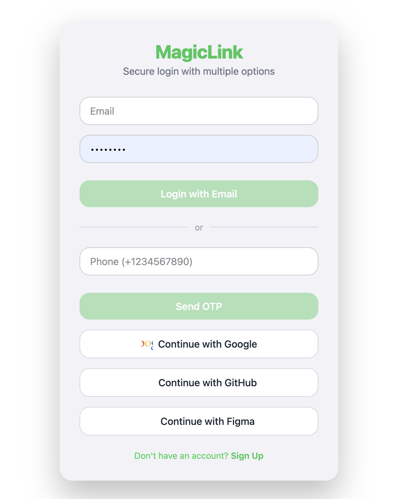
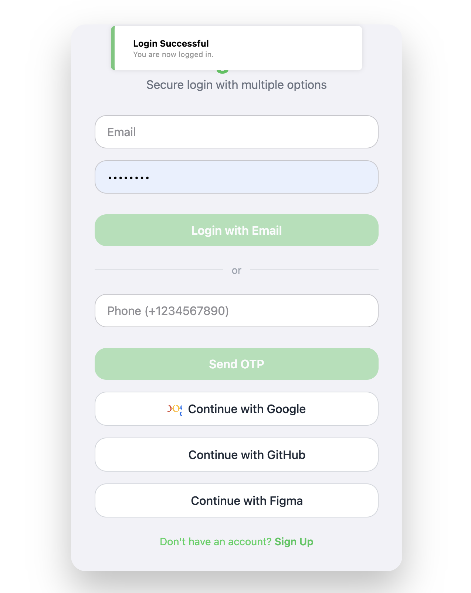
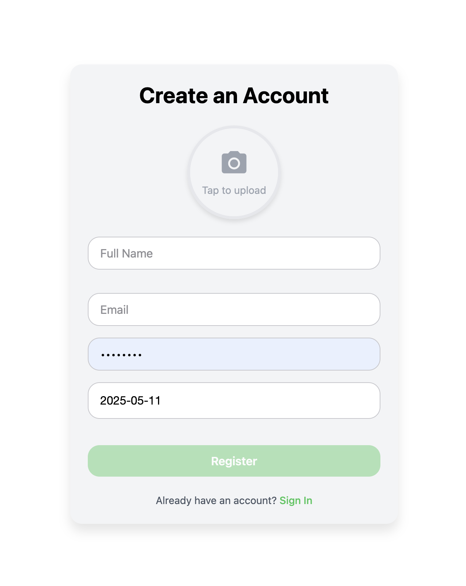
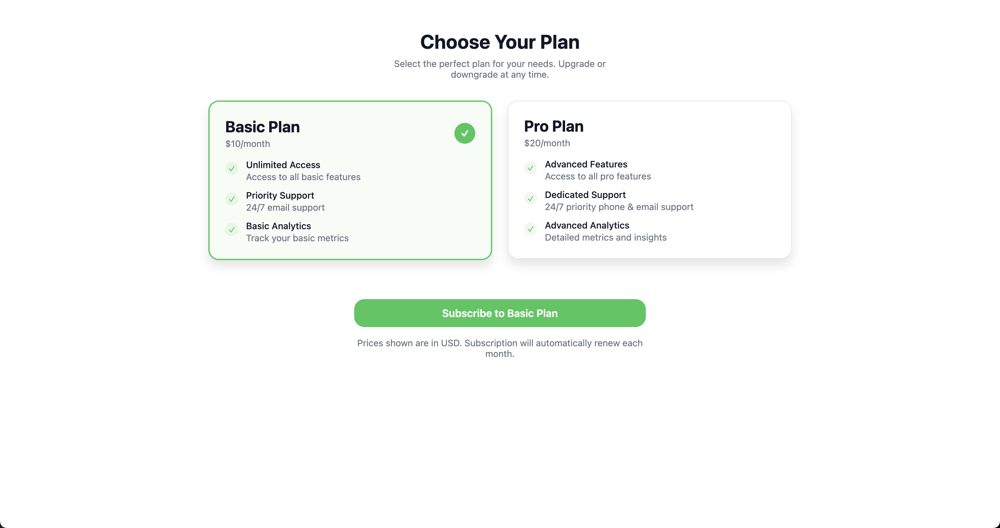
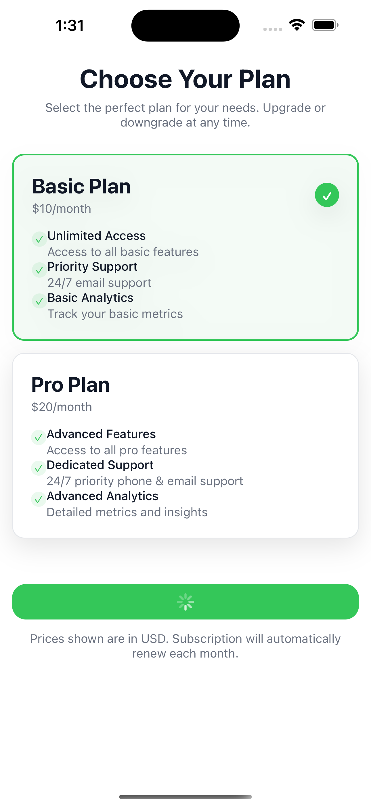

# Supabase Authentication Starter

This repository provides a ready-to-use authentication system integrated with **Supabase** to speed up your development process when building applications with user authentication. It includes password-based authentication, phone-based OTP, and social login (Google, GitHub, and Figma), allowing developers to quickly implement secure user management.

## 📸 Screenshots






## ✨ Features

- **Email & Password Authentication** – Secure registration and login using traditional credentials.
- **Phone Authentication with OTP** – Users can log in using their phone numbers via Supabase OTP flow.
- **Google, GitHub & Figma OAuth Login** – One-click login using third-party identity providers.
- **Email Verification** – Automatic verification emails for new sign-ups.
- **Session Management** – Real-time session detection and token handling.
- **Error Feedback** – Friendly error messages and alerts.
- **Responsive UI** – Built using Tailwind CSS via NativeWind for clean and consistent mobile styling.
- **Platform Support** – Works seamlessly across iOS, Android, and Web (with Expo).

## 📚 Table of Contents

1. [Prerequisites](#prerequisites)
2. [Installation](#installation)
3. [Usage](#usage)
4. [Folder Structure](#folder-structure)
5. [Code Walkthrough](#code-walkthrough)
6. [Contributing](#contributing)
7. [License](#license)

---

## ✅ Prerequisites

To use this project, ensure you have:

- **Node.js** (>= 14.x)
- **Expo CLI** – `npm install -g expo-cli`
- **Supabase account** – [Create here](https://supabase.com)
- **Google Developer account** (for OAuth setup)
- **React Native development environment** (iOS/Android simulator or real device)

---

## 🛠 Installation

1. **Clone the repository**
    ```bash
    git clone https://github.com/your-username/supabase-authentication-starter.git
    cd supabase-authentication-starter
    ```

2. **Install dependencies**
    ```bash
    npm install
    ```

3. **Set up environment variables**
    Create a `.env` file in the root directory and add:
    ```env
    SUPABASE_URL=https://your-project.supabase.co
    SUPABASE_ANON_KEY=your-anon-key
    ```

4. **Configure Supabase**
    - Go to [Supabase](https://app.supabase.com), create a new project.
    - Enable **Email/Password**, **Phone**, and **OAuth** (Google, GitHub, Figma) under `Authentication > Providers`.

5. **Configure OAuth (e.g. Google)**
    - Go to [Google Developer Console](https://console.developers.google.com/)
    - Create credentials for a Web or iOS/Android app
    - Add Supabase’s OAuth redirect URL:  
      ```
      https://your-project.supabase.co/auth/v1/callback
      ```

6. **Start the development server**
    ```bash
    expo start
    ```

---

## 🚀 Usage

You can use the components included to allow users to:

### 🔐 Sign Up with Email

```
import { supabase } from './lib/supabase';

const { error } = await supabase.auth.signUp({
  email: 'user@example.com',
  password: 'securePassword',
});
```

### Sign In with Email & Password
```
const { data, error } = await supabase.auth.signInWithPassword({
  email: 'user@example.com',
  password: 'securePassword',
});
```

### Sign In with Phone (OTP)
```
const { error } = await supabase.auth.signInWithOtp({
  phone: '+1234567890',
});
```

### Sign In with Google or GitHub
```
await supabase.auth.signInWithOAuth({ provider: 'google' });
await supabase.auth.signInWithOAuth({ provider: 'github' });
```

This project is licensed under the [MIT License](https://opensource.org/licenses/MIT).
